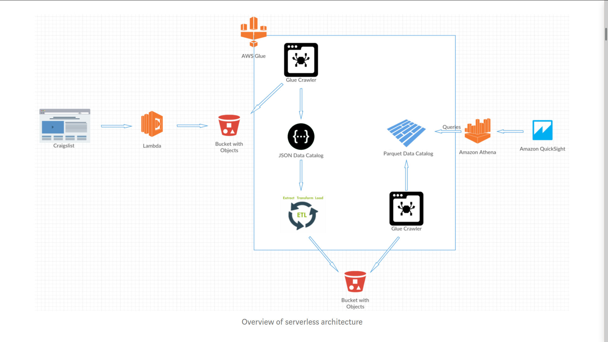
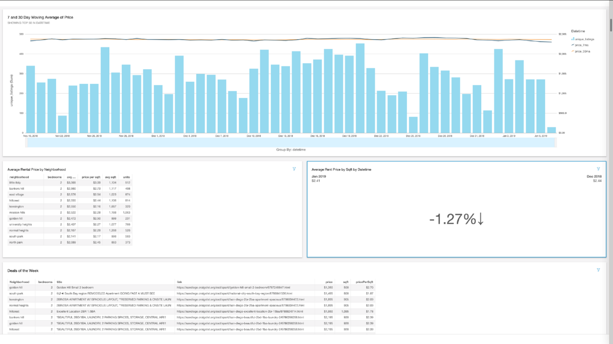
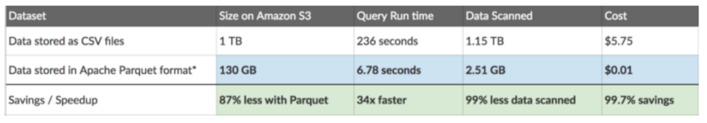

# Serverless-ETL-AWS
 

### Problem
I'm trying to find a good neighborhood that works for my budget and I would like to have a price-tracking application of my own but don't want to go through the pain of maintaining the application.

### Solution
Serverless ETL pipeline in AWS using S3, Lambda, Athena, Quicksight. Data would be scrapped from Criagslist into S3 using lambda, ETL will be performed by Glue, Athena provides complex SQL aggregates to Quicksight's visualization.

### Architecture
 <br />

***Deep Dive***
- I have a file in S3 called neighborhoods.txt which is simply just a list of neighborhood names on each line
- My lambda function picks up the neighborhoods and scrapes the data from craigslist and stores the data in S3.
  - since we are going to be using AWS Glue’s crawlers to crawl our json files, the json files need to adhere to a format required by Hive json SerDe
- After creating my function, I used the [Serverless](https://www.serverless.com/) platform to easily upload it to AWS Lambda via the command line
- ETL in Glue (Spark and Hive catalogue in the back-end)
  - A Glue crawler to infer the json schema for my data in S3 (custom classifier: $[*])
  - A Glue Job to convert the json data to parquet format
  - A crawler to infer the schema from the parquet data format
- Athena Query (presto in the back-end)
  - You can directly query the data on S3
- Connect athena as data source to Quicksight. Utilize the moving_average query to create an other data source. Visualize from the both data sources.

### Dashboard
 <br />

### CSV vs Parquet
 <br />

### Instructions
#### Set up serverless for the bundled deployment of dependencies in lambda
- You need nodejs and npm to install serverless
```
npm install -g serverless
```
- Create template
```
serverless create --template aws-python3
```
- dropping your requirements (always use virtual environments)
```
pip freeze > requirements.txt
```
- generate package.json
```
npm init --yes
```
- Edit serverless.yml as per the repo. Bundling packages
```
npm init --yes
```
- Deployment and invocation (Makes sure lambda has access to S3)
```
sls deploy
sls invoke -f cl_crawler --log
```

### License
[MIT License](LICENSE) <br />
Copyright (c) 2020 Hemanth Devarapati (<hemanthsaid7@gmail.com>)

